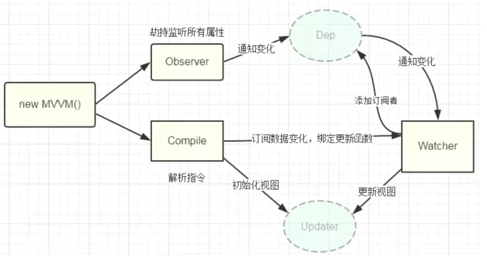

# MiniVue

手写实现Mini版Vue

实现过程：

[图片来源](https://juejin.cn/post/6844904183938678798)



### 发布订阅的关键步骤
   这里发布订阅触发的前后步骤：从MVue里开始

1. `new Observer` 的时候给所有数据绑定了 `getter/setter`，同时每一层数据 data 都有一个 `dep` 实例

2. `new Compile` 的时候编译节点触发 `compileUtil` 里 执行 `new Watcher`

3. `new Watcher` 里的 `getOldVal` 先 `Dep.target = this`，把 `wathcer` 自身绑到 `Dep` 类上，然后调用 `compileUtil.getVal`

4. `getVal` 里有操作 `data[curVal]` ，会触发这个 `data[curVal]` 的 `getter`

5. `getter` 里判断执行 `Dep.target && dep.addSub(Dep.target)` 【Dep.target 的值第3步加上的】，这样 `dep` 实例的 `subs` 就有了一个 `watcher`

6. 回到 `watcher` 的 `getOldVal` 里，要把 `Dep.target` 置 `null`，否则下次谁再执行 `getter` 的时候，`Dep.target` 里就有其他的 `wathcers`，然后这些 `wathcers` 会被添加进别人的 `dep.subs` 里

### 代理 vm.$data 原理

在 `MVue` 里遍历 data 的 key（第一层的就行）,也是劫持方式
```js
Object.defineProperty(this, key, {
  get() {
    // 当输入 this.msg/vm.msg 的时候，本身没有msg这个属性，我们劫持他返回$data.msg
    return data[key]
  },
  set(val) {
    data[key] = val
  }
})
```

### 对 {{xx}} 文本节点的处理

因为可能存在形如 `{{person.name}} --- {{person.age}}` 这种形式存在，假设触发 `person.name` 的 `watcher` ，但是不能直接调用 `updater.textUpdater(node, newVal)` ，这样会把原来假设是 `xiaoming --- 18` 替换成 `lisi` （整体被一个 `person.name` 的新值 `lisi` 替换了）。

所以我们调用 `getContent(expr, vm)` ，对整个节点做处理替换，这里传入的 `expr` 就是 `{{person.name}} --- {{person.age}}` ，会循环遍历里面的每一个值去取当前的值去进行替换
```js
getContent(expr, vm) {
  return expr.replace(/\{\{(.+?)\}\}/g, (...args) => {
    return this.getVal(args[1], vm)
  })
}
```
